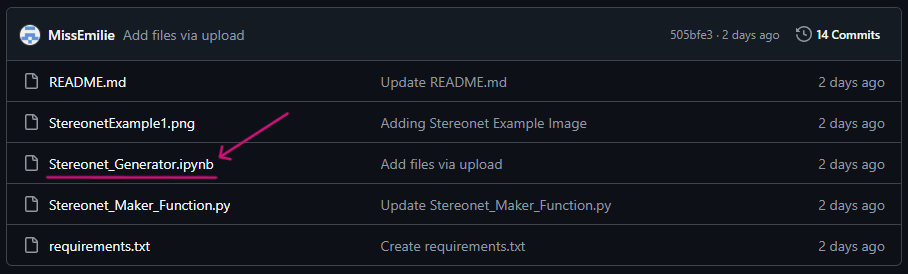
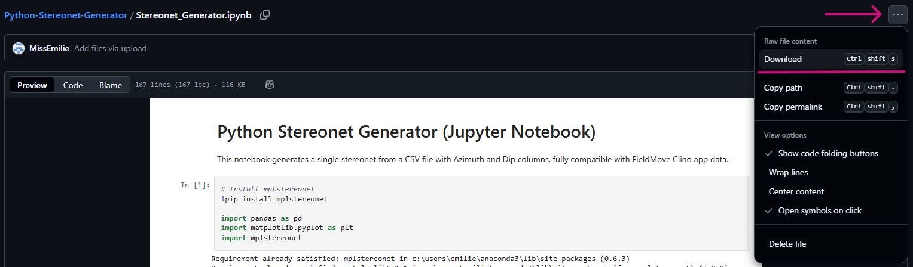
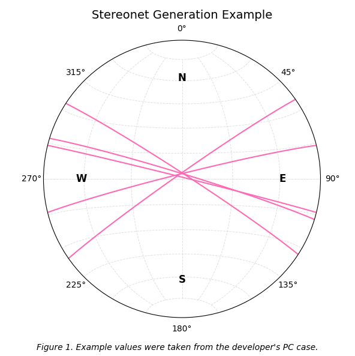

# Python Stereonet Generator
A python script to generate a stereonet with a csv file with dip and azimuth columns - fully compatible with the FieldMove Clino app.

## Usage

Download the [.py file](Stereonet_Maker_Function.py) or the [.ipynb file](Stereonet_Generator.ipynb) with these links or from the repo above.



Click the three dots at the top, then download, or use the hotkey Ctrl + Shift + S.



Unzip the file and open it with a code editor or within Jupyter Notebook.

### Requirements:
- Python 3.8+
- pandas
- matplotlib
- mplstereonet - read official documentation [here](https://pypi.org/project/mplstereonet)

To install these libraries using pip, run the following in the command prompt of your code editor of choice:
```bash
pip install pandas
```
```bash
pip install matplotlib
```
```bash
pip install mplstereonet
```

## Example Usage

Inputted csv file:
```csv
Azimuth  Dip
017      087
033      087
325      087
346      087
014      089
```

Example Strike Calculation

```
Strike = (Azimuth - 90) % 360

Strike = (017 - 90) % 360

Strike = 287
```

Example Output:



*All values were taken using the FieldMove Clino App.*

## Customization

The resulting Stereonet can be customized both through inputs and through direct edits to the code.

### Inputs

- Title: The title will appear at the top of the stereonet, in 14pt font.
- Caption: The caption will appear at the bottom, in 12pt font and in italics.

Usually, these are to define the location, outcrop or bedding that was measured.

### Code Editing

- Location, font size, style, weight, padding and colour of text
``` bash
fig.text(fontsize=10, style="italic", color="black", fontweight="bold", pad=30)
```
- Colour and line style of planes
``` bash
ax.plane(color="black", linestyle="-")
```
- Size of the resulting Stereonet figure
``` bash
fig = plt.figure(figsize=(6, 6))
```

## Licenses
Free use for educational purposes or personal use.

