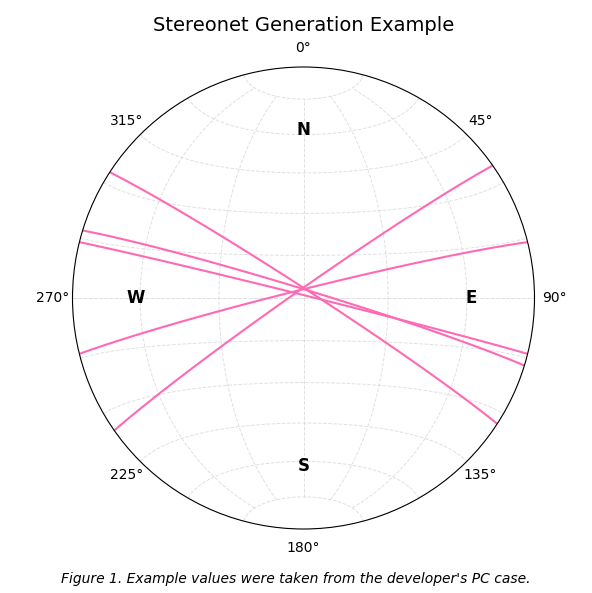

# Python Stereonet Generator
A python script to generate stereonets with a csv file with dip and azimuth columns - fully compatible with the FieldMove Clino app.

## Usage
### Online through Github
Just run the function and add in a csv file, title and caption when prompted. Title and caption are optional.

### Offline / Download
If you would like to download this code for usage offline, in the field or for any other reason, please feel free to do so!

Requirements:
- Python 3.8+
- pandas
- matplotlib
- mplstereonet - read official documentation [here](https://pypi.org/project/mplstereonet)

To install these libraries using pip, run the following in the command prompt of your code editor of choice:
```bash
pip install pandas
```
```bash
pip install matplotlib
```
```bash
pip install mplstereonet
```

## Example Usage

Inputted csv file:
```bash
Azimuth  Dip
017      087
033      087
325      087
346      087
014      089
```

Example Output:



*All values were taken using the FieldMove Clino App.*

## Customization

For now, the only customization is the title and caption of the stereonet. Usually, these are to define the location, outcrop or bedding that was measured.

Title: The title will appear at the top of the stereonet, in 14pt font. 

Caption: The caption will appear at the bottom, in 12pt font and in italics.

## Licenses
Free use for educational purposes or personal use.

